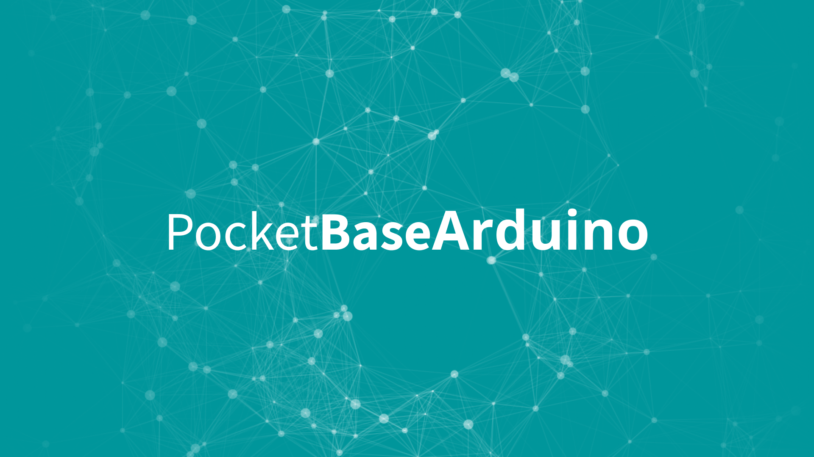

# PocketbaseArduino

<div align="center">




[](CONTRIBUTING.md)
[](https://opensource.org/)


</div>

<div align="center">

[](https://github.com/jeoooo)

</div>

Arduino ESP8266/ESP32 Wrapper Library for Pocketbase

## Table of Contents

- [PocketbaseArduino](#pocketbasearduino)
  - [Table of Contents](#table-of-contents)
  - [Installation](#installation)
  - [Usage](#usage)
  - [Contributing](#contributing)
  - [License](#license)

## Installation

TODO: Instructions on how to install and set up your project.

## Usage

```cpp

#include "PocketBaseArduino.h"

// ESP8266
#include <ESP8266WiFi.h>
#include <ESP8266HTTPClient.h>

// FOR ESP32
// #include <HTTPClient.h>
// #include <WiFi.h>
// #include <WiFiClientSecure.h>

// HTTPS REQUESTS
#include <BearSSLHelpers.h>

const char *ssid = "YOUR_SSID";
const char *password = "YOUR_PASSWORD";

// initializing the Pocketbase instance
PocketbaseArduino pb("YOUR_POCKETBASE_BASE_URL");
String record;

void setup()
{
    Serial.begin(115200);
    WiFi.begin(ssid, password);

    while (WiFi.status() != WL_CONNECTED)
    {
        delay(1000);
        Serial.println("Connecting to WiFi...");
    }

    // Initialize PocketbaseArduino with your base URL, supports both http and https
    // PocketbaseArduino pb("https://jeo-pockethost-instance.pockethost.io");
    // PocketbaseArduino pb("http://192.168.100.106:8090");

    // Example usage of getOne() function 
    // getOne("ckf93agrsjettfx", "expand", "fields"), 
    // if expand or fields are empty place nullptr
    record = pb.collection("notes").getOne("ckf93agrsjettfx", "expand", "fields");

    // Example usage of getList() function 
    // getList("page", "perPage", "sort", "filter", "skipTotal", "expand", "fields"), 
    // if expand or fields are empty place nullptr
    record = pb.collection("notes").getList("page", "perPage", "sort", "filter", "skipTotal", "expand", "fields");

    // Example usage of deleteRecord function
    // deleteRecord("record_id");
    record = pb.collection("notes").deleteRecord("record_id");

    // printing data
    Serial.println(record);
}

void loop()
{
    // Fetches and prints data from the 'notes' collection every 5 seconds
    record = pb.collection("notes").getList("page", "perPage", "sort", "filter", "skipTotal", "expand", "fields");
    Serial.println("Data from 'notes' collection:\n" + record);
    delay(5000);
}

```

## Contributing

1. this Github repository.
2. Create your feature branch (`git checkout -b my-new-feature`).
3. Commit your changes (`git commit -am 'Add some feature`)
4. Push to the branch (`git push origin my-new-feature`)
5. Create a 

## License

GPL-3.0 license
